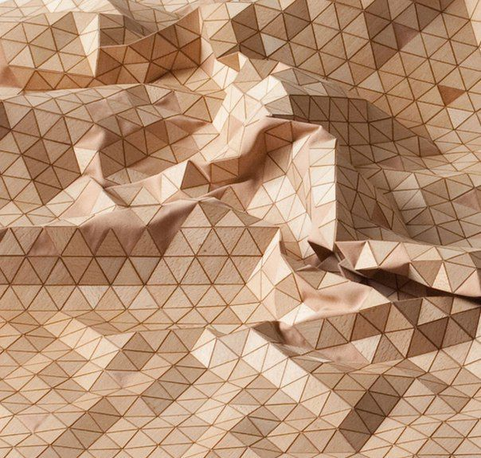
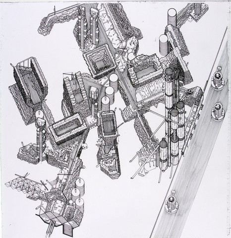

# Cecilia Castañeda 

## Perfil

**Disciplina / formación:** Soy arquitecta, docente y ceramista. Mi trabajo se mueve principalmente entre la arquitectura, la representación, la enseñanza y la exploración de la cerámica como material.

**Qué hago hoy:** Actualmente hago clases en arquitectura y diseño, principalmente en representación y herramientas digitales. En paralelo trabajo con cerámica, donde me interesa mezclar procesos manuales con nuevas herramientas y tecnologías. Últimamente he empezado a interesarme más por la fabricación digital y la impresión 3D, especialmente vinculada a la cerámica y la arquitectura. Es un área en la que todavía estoy comenzando y que me gustaría seguir explorando. 

**Qué me gustaría aprender en este curso:**  
Me gustaría aprender a utilizar la programación y el diseño computacional como nuevas herramientas dentro de mi proceso de diseño. Me interesa entender cómo trabajar con datos, reglas y parámetros para generar geometrías y eventualmente relacionarlas con procesos de fabricación.
## Intereses

- Arquitectura, representación y docencia
- Cerámica e investigación material
- Diseño computacional y fabricación digital

## Preguntas que me interesan explorar

**¿Cómo puedo transformar el comportamiento de un material en reglas que generen geometrías?**
Esta pregunta, esta en relación a la investigación que estamos haciendo en el MCD

Desde algo más personal, ligado a mis intereses

**¿Cómo puedo transformar información de elementos naturales en reglas para generar geometrías?**

Me interesa observar elementos de la naturaleza, reconocer patrones, medidas, repeticiones o variaciones y entender cómo esa información se puede transformar en nuevas formas geométricas.

## Algo que me inspira

Me interesa el cruce entre arquitectura, cerámica y tecnología. Sobre todo los proyectos donde la forma aparece a partir de la experimentación con un material, una regla o un proceso, y no solamente desde una forma diseñada previamente.

Actualmente estoy comenzando a explorar referentes relacionados con fabricación digital, impresión 3D y diseño computacional, buscando entender cómo estas herramientas pueden incorporarse a mi propio trabajo con cerámica y arquitectura.

## Links

- [Instagram](https://www.instagram.com/c_castaneda/)
- [LinkedIn](https://www.linkedin.com/in/cecilia-casta%C3%B1eda-2848aa111/)
